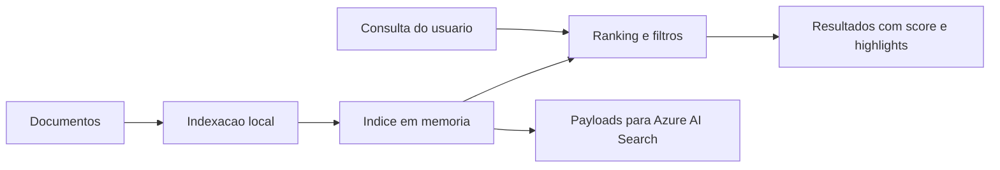

# Azure AI Search para Indexacao e Consulta de Dados

## O que o projeto entrega

- API REST para indexacao e busca
- dataset de documentos tecnicos de exemplo
- motor local de relevancia com score e highlights
- filtros por categoria e tags
- endpoint para estatisticas do indice
- payload de schema compativel com Azure AI Search
- payload de upload de documentos em formato proximo ao REST da plataforma
- testes automatizados
- Dockerfile para execucao local

## Arquitetura do MVP



## Endpoints

### `POST /api/index/load-sample`

Carrega o dataset de exemplo e reconstrui o indice.

### `POST /api/index/documents`

Adiciona ou atualiza documentos no indice local.

### `GET /api/index/stats`

Retorna quantidade de documentos, termos unicos e categorias.

### `POST /api/search/query`

Executa busca com ranking local, filtros e highlights.

### `GET /api/azure/index-schema`

Retorna um schema de indice no formato esperado pelo Azure AI Search.

### `GET /api/azure/upload-payload`

Retorna um payload de upload de documentos em formato proximo ao usado pela API REST do Azure AI Search.

## Como executar localmente

### Com Python

```bash
pip install -r requirements.txt
uvicorn app.main:app --reload
```

### Com Docker

```bash
docker build -t azure-ai-search-demo .
docker run -p 8000:8000 azure-ai-search-demo
```

## Exemplo de consulta

Use o payload em [sample-search-request.json](examples/sample-search-request.json):

```json
{
  "query": "semantic search relevance",
  "top": 3,
  "category": "search",
  "tags": []
}
```

## Estrutura do projeto

- `app/main.py`: endpoints da API
- `app/search_engine.py`: indexacao, ranking e highlights
- `app/azure_payloads.py`: payloads de schema e upload para Azure
- `app/sample_loader.py`: ingestao do dataset local
- `data/sample_documents.json`: documentos de exemplo
- `docs/azure-mapping.md`: mapeamento entre demo local e Azure AI Search
- `tests/test_search_api.py`: testes do fluxo principal

## Relacao com Azure AI Search

O projeto foi desenhado para ficar didatico e portavel:

- localmente, ele mostra a experiencia de ingestao e consulta
- conceitualmente, ele espelha indice, documentos, filtros e semantic configuration
- operacionalmente, ele ja gera payloads que servem de base para migracao ao Azure AI Search

Isso ajuda a mostrar entendimento de produto e arquitetura, mesmo sem depender de credenciais de nuvem para demonstracao.

## Referencias oficiais

Usei como base documentacao oficial da Microsoft para manter o nome atual do servico e alinhar os conceitos:

- [Azure AI Search documentation](https://learn.microsoft.com/en-us/azure/search/)
- [Create an index in Azure AI Search](https://learn.microsoft.com/en-us/azure/search/search-how-to-create-search-index)
- [Upload, merge, or delete documents in Azure AI Search](https://learn.microsoft.com/en-us/azure/search/search-how-to-load-search-index)
- [Semantic ranking in Azure AI Search](https://learn.microsoft.com/en-us/azure/search/semantic-search-overview)

## Validacao

```bash
pytest
```

Os testes cobrem:

- carga do dataset de exemplo
- ranking de resultados
- filtros por tags
- geracao de payloads para Azure

## Proximos passos

- adicionar persistencia real
- incluir vetores e busca hibrida
- conectar com Azure Blob Storage
- criar indexador e skillset de exemplo
- adicionar interface web para Search Explorer local
